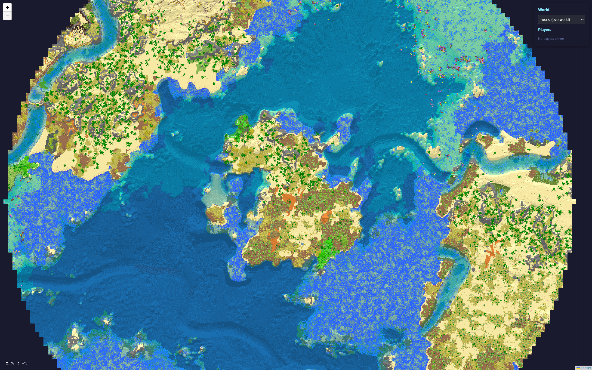

# AllayMap

A minimalistic and lightweight real-time world map viewer for [Allay](https://github.com/AllayMC/Allay) servers, using vanilla map rendering style.



## Features

- Real-time map rendering with vanilla Minecraft map colors
- Multi-zoom support (6 zoom levels)
- Biome-aware coloring (grass, foliage, water tinting)
- Player tracking with live position updates
- Multi-world and multi-dimension support
- Lightweight web interface
- Automatic chunk rendering on exploration

## Installation

1. Download the latest release from the releases page
2. Place the JAR file in your Allay server's `plugins` folder
3. Start or restart your server
4. Access the map at `http://localhost:8080` (default port)

## Configuration

Configuration file is located at `plugins/AllayMap/config.yml`:

```yaml
# Port number for the web interface
# The map will be accessible at http://localhost:<port>
# Make sure this port is not used by other applications
# Valid range: 1-65535 (ports below 1024 may require admin privileges)
# Default: 8080
http-port: 8080

# Interval in seconds between processing dirty (modified) chunks
# Lower values = faster map updates but higher CPU usage
# Higher values = slower map updates but lower CPU usage
# Recommended: 30-120 seconds depending on server performance
# Default: 60
update-interval: 60

# Whether to render blocks underwater
# If disabled (false), water surfaces will show biome water color directly
# If enabled (true), underwater blocks will be visible with water tint applied
# Disabling this can improve map readability in ocean/river areas
# Default: false
render-underwater-blocks: false

# Whether to ignore the height map of the world
# If disabled (false), the height map of the world will be used during map tile generation to improve the speed
# If enabled (true), the map renderer will always traverse the blocks down from the dimension's maximum height
# This would be useful when the height map of the world is incorrect (set to true)
# Default: false
ignore-world-height-map: false
```

## Usage

- Open `http://localhost:8080` in your browser
- Use mouse wheel to zoom in/out
- Click and drag to pan the map
- Select different worlds/dimensions from the dropdown
- Click on a player name to center the map on their location

## License

This project is licensed under the MIT License - see the [LICENSE](LICENSE) file for details.
